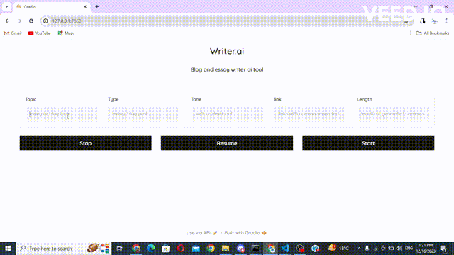
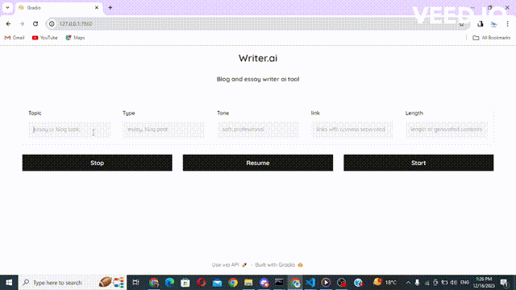

# AI_CONTENT_WRITER
AI_CONTENT_WRITER is an innovative AI-powered content generation system designed to transform essay and blog post creation. Users simply input their chosen essay or blog post topic, and AI_content_writer utilizes its vast knowledge base and contextual understanding to produce high-quality essay and blog post.
## Demo

#### 👨🏻‍🎨 Blog post and essay
<table>
<tr>
   <td> 
      
   </td>
    <td> 
      
   </td>
</tr>
</table>

## Setup
  ```code
  git clone https://github.com/USTAADCOM/AI_Content_writer.git
  cd AI_Content_writer
  pip install -r requirements.txt -q
  ```
## Instructions
* create .env file
* paste
```code
OPENAI_API_KEY = "Your api key here"
```

## Run Tool
```code
  app.py
```